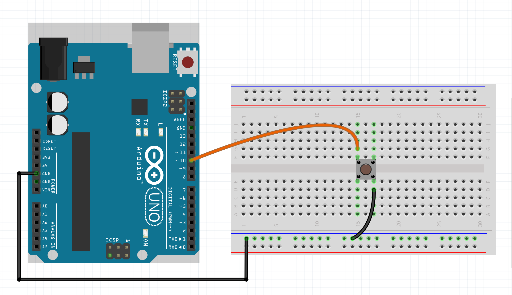

# Button hookup guide

A button is a simple yet essential component in electronics, allowing 
you to interact with a device. When integrated into an Arduino project, 
buttons can trigger various actions, from turning on LEDs to controlling 
motors. We can use many types of buttons like momentary push buttons & 
toggle switches. This guide will cover the basics on how to hook up a 
momentary push button to an arduino

***

### Parts required

* An Arduino Uno (or any other Arduino-compatible board)
* 1x momentary switch / button
* A solderless breadboard
* Some jumper wires (male to male)
***

### Instructions

We will be using a momentary SPST (Single Pole Single Throw) button, 
the simplest type of switch in electronic circuits. It has 
only one input and one output, allowing it to connect or 
disconnect a single line in a circuit. Essentially, it's 
like a basic on/off switch.

If you'd like to learn more about buttons, you can find detailed 
information here: https://learn.sparkfun.com/tutorials/button-and-switch-basics

The CTRL library implements an interface for buttons that 
are normally pulled HIGH (by setting the pinMode to INPUT_PULLUP). 
This method has several advantages:

* Noise Reduction: Reduces electrical noise and prevents false triggering.
* Simpler Circuit Design: Utilizes the microcontroller's internal pull-up resistors, eliminating the need for external resistors.
* Known Default State: Ensures a stable HIGH state when the button is not pressed.
* Prevent Shorts: Minimizes the risk of shorts by using a safe default HIGH state.
* Compatibility: Aligns with many standard libraries and examples that assume a normally HIGH state for buttons.

Understanding these technical details helps explain why this 
approach is used. Now, let's move on to hooking up the button. 
Refer to the figure below and connect all the components as shown.



Note that this button is wired from ground to the Arduino pin. This is because by 
default, a CtrlBtn has the pinMode configured to 'INPUT_PULLUP', meaning that an 
internal pull-up resistor has been activated, pulling the pin HIGH when the button 
is not pressed. Pressing the button pulls the pin to LOW. Not all boards have 
internal pull-up or pull-down resistors, so you then want to set it to 'INPUT'
and implement your own external pull-down or pull-up resistor. You can then 
optionally set the second parameter to 'PULL_DOWN' or 'PULL_UP' (default is 'PULL_UP').

Example:
```c++
void setup() {
  button.setPinMode(INPUT, PULL_DOWN);
}
```

***

### Example code

We will assume you know how to use the Arduino IDE and upload your sketches 
to a board. If not, have a look at the tutorials at: https://www.arduino.cc/guide

Also make sure you have the CTRL library installed through the library manager.

NOTE: Then upload the sketch to your board and open up the serial monitor.
This allows you to see the output of the button press & release. For some boards
you have to set the 'USB Type' to 'Serial', in the Arduino IDE under 'Tools'.

```c++
#include <CtrlBtn.h>

// Define an onPress handler.
void onPress() {
  Serial.println("Button pressed");
}

// Define an onRelease handler.
void onRelease() {
  Serial.println("Button released");
}

// Create a button with the signal pin number, bounce duration,
// onPress (optional) & onRelease (optional) handler.
CtrlBtn button(10, 15, onPress, onRelease);

void setup() {
  Serial.begin(9600);
}

void loop() {
  // The process method will poll the button object and handle all it's functionality.
  button.process();
}
```