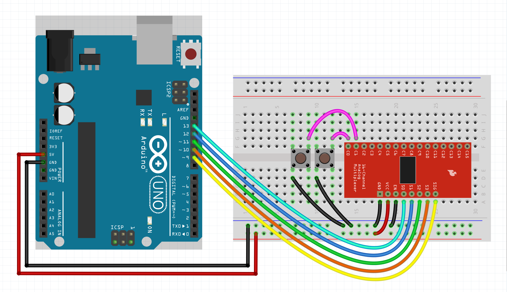

# Multiplexer hookup guide

Connecting multiple buttons to a microcontroller can be a challenge, 
especially when dealing with a large number of inputs. A multiplexer 
offers an efficient solution by allowing up to 16 buttons to be 
interfaced with just a single pin (and a few channel switching pins). 
This guide will walk you through the process of hooking up buttons to 
the CD74HC4067, making it easier to expand your project without 
needing additional pins on your microcontroller.

***

### Parts required

* An Arduino Uno (or any other Arduino-compatible board)
* 2x momentary switch / button
* 1x 16 channel CD74HC4067 multiplexer
* A solderless breadboard
* Some jumper wires (male to male)

***

### Instructions

The multiplexer has 8 pins to consider:
- VCC - the supply voltage input pin
- GND - the ground connection pin
- EN - pin for enabling/disabling the mux (pulling it LOW enables it / pulling it HIGH disables it)
- S0, S1, S2, and S3 are address selection pins used to specify which input channel to connect to the output.
- SIG - the signal input/output pin

Now hook up the components according to the figure below.



As your circuit grows in complexity, adding a decoupling capacitor across the VCC
and GND pins becomes increasingly important. This capacitor serves to stabilize
the voltage supply, reduce noise, and improve overall performance and reliability.
In this case you could start with a 100 nF capacitor. Put it as close as possible
to the VCC and GND pin of the multiplexer. If that is not enough you can go up to
something like 1 µF (if you are dealing with a very noisy system). Note that going
up in capacitance comes with trade-offs such as increased component size, cost,
and potential impact on circuit response time.

***

### Example code

We will assume you know how to use the Arduino IDE and upload your sketches
to a board. If not, have a look at the tutorials at: https://www.arduino.cc/guide

NOTE: In the Arduino IDE under 'Tools', make sure to set the 'USB Type' to 'Serial'.
Then upload the sketch to your board and open up the monitor when done. 
This allows you to see the output of the button presses.

P.S.You can easily adapt this guide to work for potentiometers and rotary encoders.
Just create a bunch of [potentiometers](potentiometers.md) or [rotary encoders](rotary_encoders.md) 
and pass a reference of the multiplexer to them (&mux).

```c++
#include <CtrlMux.h>
#include <CtrlBtn.h>

// Create a multiplexer object. With:
// The amount of pins used, switchInterval (in microseconds), signal pin, s0, s1, s2 & s3 (optional).
CtrlMux mux(2, 10, 9, 13, 12, 11, 10);

// Define an onPress handler for button 1.
void onPress1() {
    Serial.println("Button 1 pressed");
}

// Define an onPress handler for button 2.
void onPress2() {
    Serial.println("Button 2 pressed");
}

// Create two buttons. With the: signal pin number (corresponds to the attached channel on the multiplexer),
// the bounce duration, an onPress handler, without onRelease handler (we don't need it for this example)
// & a reference (&mux) to the multiplexer.
CtrlBtn button1 = CtrlBtn::create(0, 15, onPress1, nullptr, &mux);
CtrlBtn button2 = CtrlBtn::create(1, 15, onPress2, nullptr, &mux);

void setup() {
    Serial.begin(9600);
}

void loop() {
    // The process methods will poll the button objects and handle all their functionality.
    button1.process();
    button2.process();
}
```