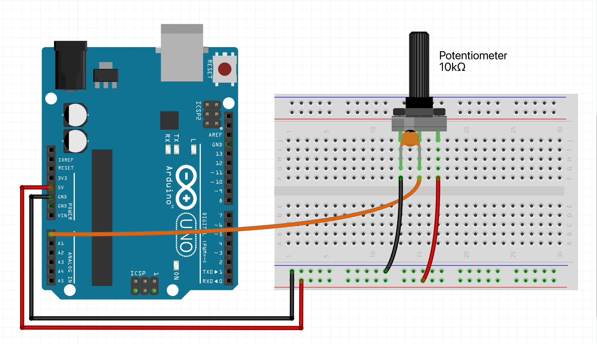

# Potentiometer hookup guide

Potentiometers are versatile components commonly used in electronics 
to adjust levels, such as volume, brightness, and position. They are 
variable resistors that can provide a range of resistance values by 
rotating a knob or sliding a lever. In this guide, we will walk you 
through the steps to connect a potentiometer to an Arduino and read 
its values.

When dealing with potentiometers, we are working with analog signals. 
Unlike digital signals, which have discrete values, analog signals 
vary continuously. This makes potentiometers more sensitive and 
susceptible to electrical noise compared to buttons and rotary encoders. 
Proper wiring and shielding can help minimize noise interference.

The CTRL library already provides some (out of the box) filtering to 
stabilize the readings of a potentiometer through a process called 
'exponential smoothing.' This technique helps to smooth out rapid 
fluctuations in the data, making the readings more stable and reliable. 
However, there can be other factors that cause unwanted readings. 
We will talk more about this in the instructions below.

***

### Parts required

* An Arduino Uno (or any other Arduino-compatible board)
* 1x 10 kΩ linear potentiometer
* 1x 10nF (up to 100nF) capacitor (ceramic & non polarized)
* A solderless breadboard
* Some jumper wires (male to male)

***

### Instructions

Connect the outer legs of the potentiometer to the ground and power rail. 
The middle pin, usually the 'wiper', will send the signal to the Arduino. 
Verify your potentiometer’s specifications to confirm the pin functions.
Connect the wiper to analog pin 0 (A0).

Include a decoupling capacitor between the wiper and ground to reduce 
electrical noise. Start with a 10nF capacitor and increase the value 
if necessary (since there is only one input device in this circuit, 
it will not matter). However, note that higher capacitance will make 
the potentiometer less responsive.



If you have motorized components in your circuit, they can introduce
significant noise. To mitigate this, place capacitors across the motor’s
power supply, use twisted pairs for the signal and ground wires to the
potentiometer, and for the motor power leads. Also, avoid running the
potentiometer’s twisted pair too close and parallel to the motor power leads
(or any other source of high frequency interference).

A good practice is to utilize separate ground (and power) rails to
separate analog inputs from digital ones (most boards have multiple ground
and power pins). Connect the analog potentiometers, to a dedicated analog
ground (and power rail), while the digital components (buttons & rotary
encoders) should be connected to a separate digital ground (and power rail).
This separation helps to reduce interference from digital switching noise.

Another factor is mechanical instability. If the potentiometer is not
securely mounted (breadboards are notoriously known for causing noisy
connections), any slight movement or vibration can affect the resistance
and, consequently, the readings. Ensuring that the potentiometer is
firmly fixed in place can help maintain consistent measurements.

***

### Example code

We will assume you know how to use the Arduino IDE and upload your sketches
to a board. If not, have a look at the tutorials at: https://www.arduino.cc/guide

Also make sure you have the CTRL library installed through the library manager.

NOTE: Then upload the sketch to your board and open up the serial monitor.
This allows you to see the output value of the potentiometer. For some boards
you have to set the 'USB Type' to 'Serial', in the Arduino IDE under 'Tools'.

```c++
#include <CtrlPot.h>

// Define an onValueChange handler
void onValueChange(int value) {
  Serial.print("Output value: ");
  Serial.println(value);
}

// Instantiate a potentiometer with the pin number, max. output value, 
// sensitivity margin (can be 0.01 to 100) & onValueChange handler.
CtrlPot potentiometer = CtrlPot::create(A0, 100, 1, onValueChange);

void setup() {
  Serial.begin(9600);
}

void loop() {
  // The process method will keep polling our potentiometer object and handle all it's functionality.
  potentiometer.process();
}
```