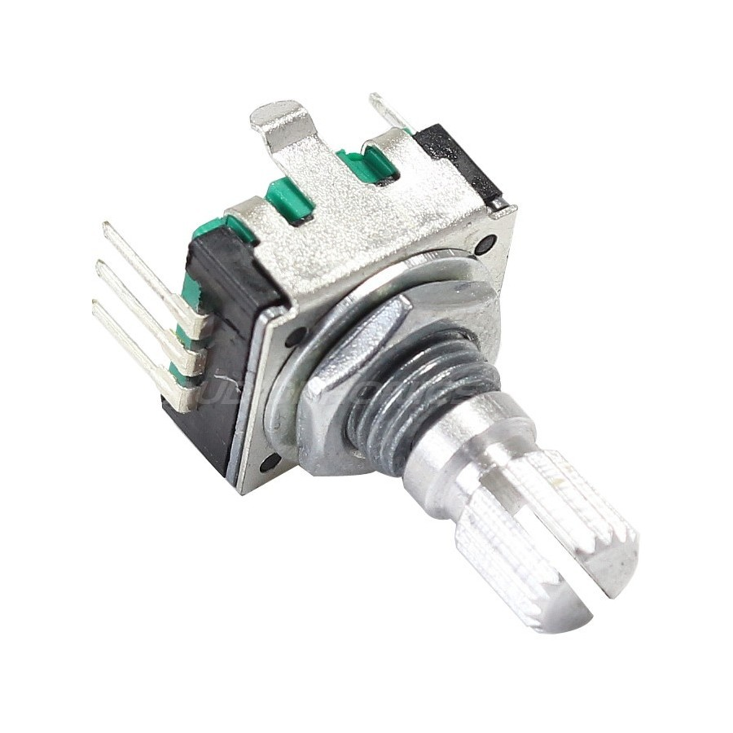
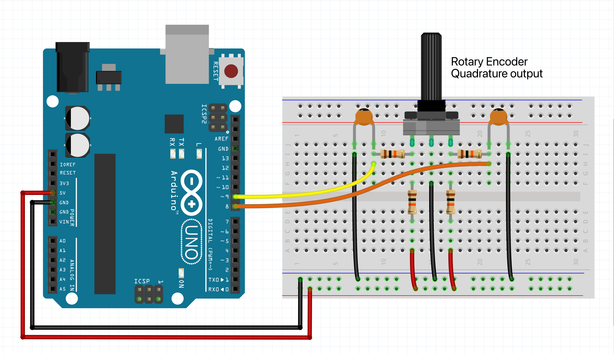
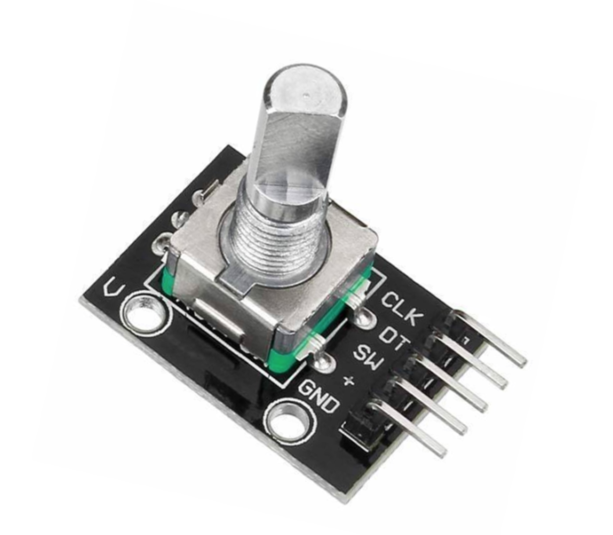

# Rotary encoder hookup guide

In this guide, we will walk you through the process of connecting 
an incremental rotary encoder with quadrature output to an Arduino UNO. 
Rotary encoders are commonly used for precise control in various 
applications, such as volume knobs, motor control, and user interfaces.
They are also less susceptible to electronic noise compared to 
potentiometers, making them an excellent choice for many projects.

Additionally, we will implement a filter circuit to improve signal 
reliability and show you how to use the CTRL library to handle 
the encoder input efficiently.

<div style="float: right; margin-left: 15px;">
  
</div>

A good-quality rotary encoder option is the <b>Bourns PEC11R</b>. This 
mechanical encoder works well with our setup, but you can also 
use other types of encoders, such as optical or magnetic. 
These alternatives will function seamlessly as long as they have 
a quadrature output.

### Parts required

* An Arduino Uno (or any other Arduino-compatible board)
* 1x Incremental rotary encoder (with quadrature output)
* 2x 0.1uF (100nF) capacitors (ceramic & non polarized)
* 4x 10 kΩ resistors
* A solderless breadboard
* Some jumper wires (male to male)

***

### Instructions

The rotary encoder has 3 pins: terminal A (which is usually the CLK pin), 
terminal B (usually the DT pin) & terminal C (normally goes to ground).
Be sure to check the schematics of your encoder, to confirm this. Next 
connect all wires and components as shown in the figure below.



***

### Example code

We will assume you know how to use the Arduino IDE and upload your sketches
to a board. If not, have a look at the tutorials at: https://www.arduino.cc/guide

NOTE: In the Arduino IDE under 'Tools', make sure to set the 'USB Type' to 'Serial'.
Then upload the sketch to your board and open up the monitor when done.
This allows you to see the output of the encoder turning.

```c++
#include <CtrlEnc.h>

// Define an onTurnleft handler.
void onTurnleft() {
  Serial.println("Turn left");
}

// Define an onTurnRight handler.
void onTurnRight() {
  Serial.println("Turn right");
}

// Create a rotary encoder with the clk signal pin number, dt signal pin, 
// onTurnleft (optional) & onTurnRight (optional) handler.
CtrlEnc encoder = CtrlEnc::create(9, 8, onTurnleft, onTurnRight);

void setup() {
  Serial.begin(9600);
}

void loop() {
  // The process method will poll the rotary encoder object and handle all it's functionality.
  encoder.process();
}
```

***

### Final thoughts

If you prefer not to build your own filter circuit, you can opt for an encoder like 
the KY-040, which comes with a built-in filter. This allows you to skip connecting the 
capacitors and resistors as described in the instructions above, and connect it directly. 
However, be aware that the quality of these encoders is often lower, as they are 
typically inexpensive.  So yeah... take your pick, have fun hooking it up, and 
hopefully you'll make some great stuff :)

<br>